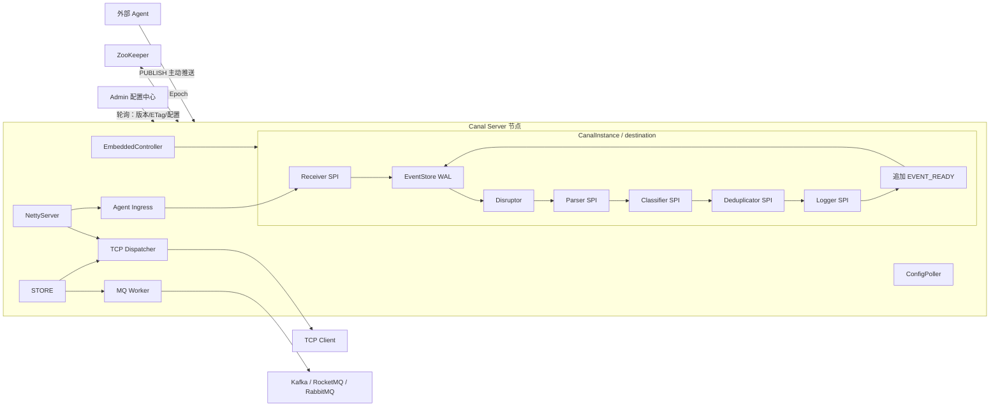
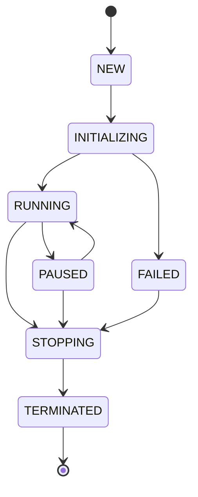
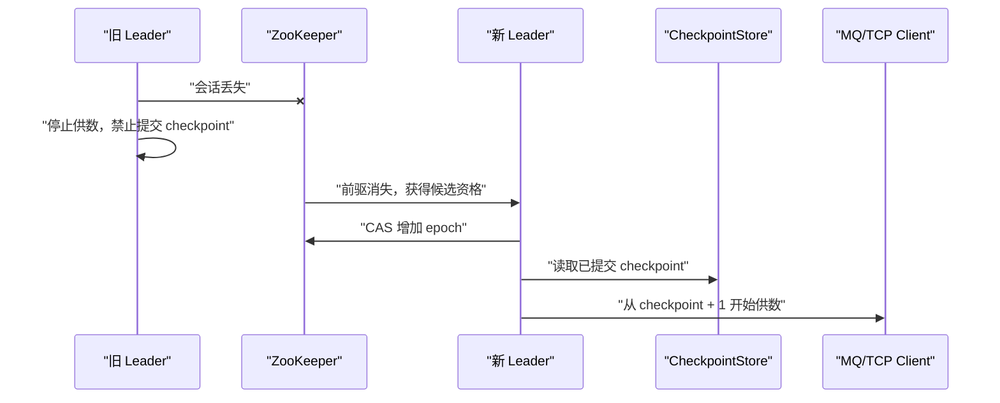
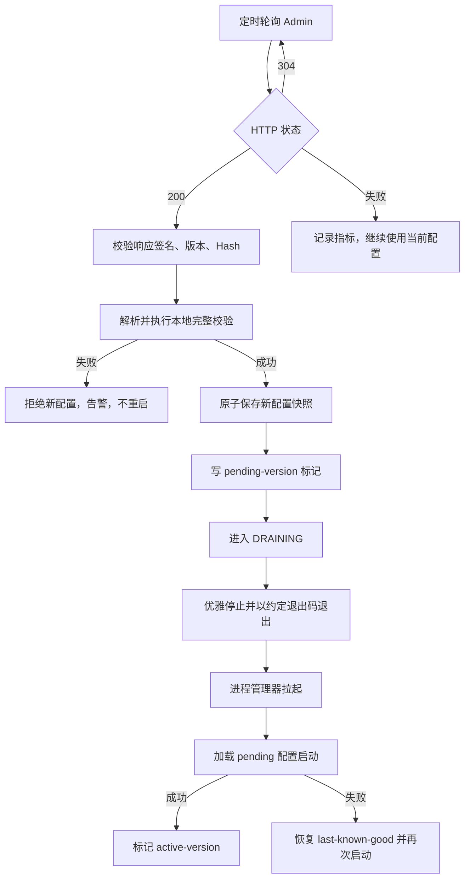
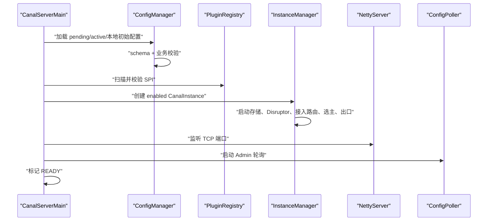

# AI Canal 资源接入、处理与分发系统开发文档

> 文档状态：第一版架构基线
> 编写日期：2026-08-13
> 目标读者：架构设计者、服务端开发者、中间件开发者、测试与运维人员

## 1. 文档目标

本文档严格围绕以下产品思路描述系统的设计和开发方案：

1. 外部 Agent 按计划从多个资源网站获取有用的资源和信息，并主动推送给 Canal Server。
2. 每一个资源网站抽象为一个 `destination`。
3. 每一个 `destination` 对应一个独立的 `CanalInstance`。
4. Canal Server 不主动访问资源网站，只暴露服务端口接收 Agent 数据；`CanalInstance` 内完成接收、解析、分类、日志记录、存储等处理。
5. 处理流水线使用 Disruptor 作为高性能内存缓冲队列。
6. 接入、解析、分类、日志、存储和数据出口等能力通过 SPI 加载，并提供默认实现。
7. `EmbeddedController` 向嵌入式调用方暴露实例管理和数据读取能力。
8. `NettyServer` 暴露 TCP 服务，同时承担 Agent 上行数据接入、节点/客户端心跳、下游数据订阅、数据发送和 ACK。
9. 每个 destination 的数据出口只能配置为 TCP 或某一种消息队列，不能同时启用。
10. 消息队列模式下，每个 destination 创建独立 Worker，从该实例的存储中读取数据并投递到消息队列。
11. 默认实现 Kafka、RocketMQ、RabbitMQ 三种消息队列出口。
12. 集群模式下，多台机器处理同一个 destination，但只能由其中一台机器对外供数。
13. ZooKeeper 用于按 destination 选主、维持租约并阻止非主节点供数。
14. Admin 服务负责配置的编辑、校验、版本化、存储和发布。
15. Canal Server 定期轮询 Admin；发现已发布配置发生变化后，保存配置并重启整个服务进程，使新配置生效。

本文档既是开发说明，也是第一阶段的架构契约。后续实现如需改变本文中的关键行为，例如修改数据一致性语义、允许 TCP/MQ 同时启用或改变 Follower 行为，应先修改本文档并记录架构决策。

---

## 2. 名词定义

| 名词 | 定义 |
| --- | --- |
| Agent | Canal Server 外部的采集与调度主体，负责访问资源网站并按接入协议主动推送数据 |
| Destination | 一个资源来源的逻辑标识，通常对应一个资源网站，也可以对应网站中的独立频道或 API |
| CanalInstance | 一个 destination 在单个 Canal Server 节点内的完整运行实例 |
| Canal Server | 承载多个 CanalInstance、NettyServer、配置轮询器和集群协调器的工作节点 |
| Admin | 管理配置的控制面服务，负责草稿、校验、版本、发布和查询，不参与资源数据传输 |
| Event | 从原始资源经过解析和分类后形成的统一数据对象 |
| Disruptor | CanalInstance 内部使用的高性能内存事件处理流水线 |
| EventStore | CanalInstance 的追加式 WAL 事件存储，默认使用分段顺序日志，是 Disruptor 恢复和 TCP/MQ 可靠供数的数据来源 |
| WAL | Write-Ahead Log；数据进入 RingBuffer 前先追加的预写日志 |
| Egress | 数据出口，取值为 TCP、Kafka、RocketMQ 或 RabbitMQ |
| Worker | MQ 模式下，一个 destination 对应的循环读取与投递任务 |
| Checkpoint | 某个数据出口已经成功确认的数据位置 |
| Ingress ACK | Canal Server 向 Agent 确认一批上行数据已经进入可靠接收边界的信号 |
| Delivery ACK | 下游 TCP 客户端或消息代理确认已收到数据的信号 |
| Leader | 某 destination 当前唯一允许对外供数的 Canal Server 节点 |
| Follower | 同 destination 的非主节点，可以接收 Agent 数据、处理和存储，但不能通过 TCP/MQ 对下游供数 |
| Epoch | destination 每次重新选主时单调递增的主节点纪元，用于 fencing |
| Fencing | 阻止失去租约的旧 Leader 继续写入或提交进度的机制 |

---

## 3. 系统范围

### 3.1 系统负责

- 暴露服务端口并接收 Agent 主动推送的原始资源。
- 校验 Agent 身份、destination、请求幂等键、协议版本和数据大小。
- 对原始内容进行解析、清洗、分类、去重和统一建模。
- 通过 Disruptor 对处理步骤进行解耦和并行化。
- 在数据进入 RingBuffer 前写入 destination 对应的 EventStore WAL，并在处理完成后追加最终事件记录。
- 记录接入、处理、发送、确认、失败和重试日志。
- 通过 TCP 或消息队列向下游提供数据。
- 维护每个出口的消费进度、ACK、重试和死信。
- 使用 ZooKeeper 保证一个 destination 在集群中只有一个供数节点。
- 使用 Admin 管理配置，并通过轮询与进程重启应用配置变更。
- 暴露运行状态、积压量、主从状态和故障指标。

### 3.2 第一阶段不负责

- 对所有异构 MQ 和本地存储提供跨系统分布式事务。
- 承诺任意下游业务的端到端 exactly-once。
- 在不重启进程的情况下完成配置热更新。
- 主动访问、抓取或轮询任何资源网站；这些行为完全由外部 Agent 负责。
- 自动理解任何网站结构；默认解析器只覆盖约定格式，特殊网站通过 SPI 扩展。
- 为下游业务完成最终业务去重；系统提供稳定 eventId，最终消费方仍需幂等。
- 由 Admin 直接远程执行 Canal Server 的启停命令；Admin 只发布配置，Server 自主轮询。

---

## 4. 总体架构



### 4.1 控制面与数据面

系统分为两个逻辑平面：

- 控制面：Admin、ConfigPoller、配置校验、版本发布、ZooKeeper 选主、状态管理。
- 数据面：Agent Ingress、Receiver、Disruptor、Parser、Classifier、EventStore、TCP Dispatcher、MQ Worker。

控制面故障时，已运行的数据面仍可继续接收 Agent 数据；ZooKeeper 会话丢失时，为避免脑裂，相关 destination 必须停止对下游供数，但接入端可继续接收并持久化数据。

### 4.2 每个 destination 的隔离原则

每一个 destination 拥有独立的：

- CanalInstance 生命周期；
- Disruptor RingBuffer；
- Agent 接入与幂等状态；
- 插件集合及插件配置；
- EventStore 命名空间；
- 数据 offset 序列；
- 出口模式和 checkpoint；
- MQ Worker 或 TCP 订阅状态；
- ZooKeeper 选主路径和 Leader 状态；
- 指标、日志和错误统计。

一个 destination 的接入异常、解析异常或出口阻塞，不得直接阻塞其他 destination。

---

## 5. 建议的工程模块

以下为默认 Java 多模块划分。模块名可以调整，但依赖方向应保持单向。

```text
ai-canal-parent
├── canal-api                 # 公共模型、异常、SPI 接口
├── canal-spi                 # SPI 注册、加载、配置绑定、生命周期
├── canal-core                # CanalInstance、Disruptor、接入路由、状态机
├── canal-storage-api         # EventStore、CheckpointStore 接口
├── canal-storage-default     # 默认 Segmented WAL 实现
├── canal-cluster-api         # LeaderElector、LeaderGuard 接口
├── canal-cluster-zookeeper   # ZooKeeper/Curator 默认实现
├── canal-egress-api          # TCP/MQ 出口公共协议
├── canal-egress-netty        # NettyServer 与 TCP 数据协议
├── canal-egress-kafka        # Kafka Worker
├── canal-egress-rocketmq     # RocketMQ Worker
├── canal-egress-rabbitmq     # RabbitMQ Worker
├── canal-ingress-netty       # Agent 上行接入协议与 Receiver 默认实现
├── canal-admin-api           # Admin 与 Server 的配置协议模型
├── canal-admin-server        # 配置编辑、版本、发布、审计
├── canal-server              # 工作节点启动器和进程装配
├── canal-testkit             # SPI、存储、MQ、集群故障测试工具
└── canal-distribution        # 配置模板、脚本、Docker/K8s 资源
```

### 5.1 依赖规则

- `canal-api` 不依赖任何实现模块。
- SPI 接口不能引用 Netty、Kafka、ZooKeeper 等具体类型。
- `canal-core` 只依赖接口和公共模型，通过 SPI 获取实现。
- 各 MQ 实现之间互不依赖。
- Admin 不依赖 CanalInstance 的运行时实现，只依赖配置协议模型。
- Server 可以依赖所有需要装配的默认实现，但业务代码不得直接 `new` 某个插件实现。

---

## 6. 核心领域模型

### 6.1 DestinationConfig

```java
public final class DestinationConfig {
    private String id;
    private boolean enabled;
    private PluginConfig receiver;
    private IngressPolicy ingress;
    private PluginConfig parser;
    private PluginConfig classifier;
    private PluginConfig deduplicator;
    private PluginConfig logger;
    private PluginConfig storage;
    private EgressConfig egress;
    private RetryConfig retry;
}
```

约束：

- `id` 在整个集群内唯一且发布后不可随意修改。
- `egress.type` 必须且只能选择 `TCP`、`KAFKA`、`ROCKETMQ`、`RABBITMQ` 中的一种。
- destination 禁用后不再创建 CanalInstance。
- Receiver、插件类型、Agent ACL 和插件参数在 Admin 发布前完成静态校验，Server 启动时再次校验。

### 6.2 RawResource

```java
public final class RawResource {
    private String destination;
    private String agentId;
    private String requestId;
    private String sourceUri;
    private String sourceKey;
    private Instant collectedAt;
    private Map<String, String> headers;
    private byte[] payload;
}
```

`requestId` 标识 Agent 的一次推送请求，Agent 重试时必须保持不变；`sourceKey` 标识资源网站中的同一个逻辑资源。服务端分别使用 requestId 做请求级幂等、使用 eventId/checksum 做事件级幂等。

### 6.3 AgentPublishRequest

```java
public final class AgentPublishRequest {
    private String agentId;
    private String requestId;
    private String destination;
    private int protocolVersion;
    private Instant sentAt;
    private List<RawResource> records;
    private String batchChecksum;
}
```

约束：

- 一个请求只允许包含一个 destination 的数据。
- `agentId + destination + requestId` 构成请求幂等键。
- records、单条 payload、整批字节数均有上限。
- Agent 超时重试必须使用原 requestId 和相同 batchChecksum；同 requestId 内容不同视为协议冲突并拒绝。
- Server 只有在该批记录已追加为 INGEST_RAW 并满足配置的 WAL 刷盘策略，或确认之前已经完成相同 WAL 接入后，才返回成功 Ingress ACK；不需要等待 RingBuffer 当下有空位，也不需要等待解析和分类完成。

### 6.4 CanalEvent

```java
public final class CanalEvent {
    private String eventId;
    private String destination;
    private long offset;
    private String sourceKey;
    private String category;
    private Instant occurredAt;
    private Instant processedAt;
    private int schemaVersion;
    private Map<String, String> attributes;
    private byte[] payload;
    private String checksum;
}
```

字段要求：

- `eventId` 必须稳定，同一原始资源重试处理时不能产生不同 ID。
- 推荐 `eventId = hash(destination + sourceKey + canonicalContent)`。
- `offset` 在一个 destination 内单调递增，默认等于 EVENT_READY 的 WAL sequence；INGEST_RAW 使用独立的 ingestSequence。
- `checksum` 用于检测数据损坏和重复。
- `schemaVersion` 用于协议演进。

### 6.5 StoredEvent

StoredEvent 除 CanalEvent 外，还应记录：

- 存储状态；
- 首次写入时间；
- 最近投递时间；
- 投递次数；
- 最近错误；
- 所属配置版本；
- 创建该事件的节点 ID。

投递状态不应只有一个全局布尔值。每个 destination 当前只有一个出口，但仍建议按 `channelId` 保存 checkpoint，便于出口迁移、重放和问题审计。

---

## 7. CanalInstance 设计

### 7.1 组件构成

```text
CanalInstance
├── DestinationContext
├── InstanceLifecycle
├── AgentDataReceiver
├── IngressRequestStore
├── WalDispatchLoop
├── DisruptorPipeline
│   ├── ParseHandler
│   ├── ClassifyHandler
│   ├── DeduplicateHandler
│   ├── AuditHandler
│   └── ReadyEventHandler
├── EventStore
├── CheckpointStore
├── DestinationLeaderGuard
└── EgressRuntime
    ├── TcpDestinationRuntime
    └── MqDestinationWorker
```

### 7.2 生命周期



启动顺序：

1. 校验 destination 配置。
2. 创建 destination 工作目录和存储命名空间。
3. 通过 SPI 加载组件。
4. 初始化 EventStore WAL、恢复索引和 CheckpointStore。
5. 初始化 Disruptor 及事件处理器，并将 WAL 中未完成记录恢复投递到 RingBuffer。
6. 启动 ZooKeeper 选举参与者。
7. 向 AgentIngressRegistry 注册 destination 接收路由。
8. 根据 egress 类型创建 TCP Runtime 或 MQ Worker。
9. 只有 Leader 才允许启动实际供数循环。
10. 标记实例为 RUNNING。

停止顺序：

1. 拒绝新的下游供数请求，并让上行 Agent 收到 `SERVER_DRAINING`。
2. 从 AgentIngressRegistry 注销 destination，不再接收新的推送批次。
3. 停止 MQ Worker 或关闭该 destination 的 TCP 数据会话。
4. 等待在途发送完成或到达优雅退出超时。
5. 等待 Disruptor 已发布事件处理完成。
6. flush EventStore、checkpoint 和审计日志。
7. 退出 ZooKeeper 选举。
8. 按加载逆序关闭 SPI 组件。

### 7.3 线程模型

- Netty ingress EventLoop：只负责连接、编解码、鉴权和轻量路由，不执行解析或存储。
- Ingress 业务执行池：处理 requestId 幂等检查、WAL 追加和刷盘确认。
- WalDispatchLoop：按 ingestSequence 把尚未处理的 WAL pointer 发布到 Disruptor；RingBuffer 满时停在当前位置等待，不丢弃 WAL 数据。
- 每个 destination 一个 Disruptor RingBuffer；槽位优先保存 WAL sequence/recordPointer，而不是复制完整 payload。
- 处理器根据依赖图并行或串行：解析先于分类，分类/日志可按需求并行，最终追加 EVENT_READY 后才允许对外供数。
- 每个 MQ destination 一个逻辑 Worker；实现上可由共享线程池承载，但必须隔离状态和 checkpoint。
- Netty 使用共享 boss/worker EventLoop，禁止在 EventLoop 中执行存储阻塞操作。
- ZooKeeper 回调线程只更新状态，不执行耗时停止或发送操作。

### 7.4 背压

- RingBuffer 满时，服务端不得无限堆积 Agent 请求。
- RingBuffer 满只会暂停 WalDispatchLoop，不撤销已经安全写入 WAL 的 Ingress ACK；只有 WAL 磁盘容量/未处理积压达到配置高水位时，新的 PUBLISH 才返回 `BACKPRESSURE_RETRY`。
- WAL 写入或刷盘变慢时，Ingress 自然形成背压，不允许先发布 RingBuffer 再补写 WAL。
- MQ/TCP 下游变慢不会直接阻塞 Disruptor，因为出口从 EventStore 读取。
- 必须设置单条 RawResource 和 CanalEvent 的最大字节数。

---

## 8. Disruptor 流水线

### 8.1 定位

Disruptor 是实例内部的高性能处理队列，负责阶段解耦和高吞吐，不承担最终数据可靠性。Agent 数据必须先追加到 EventStore WAL 并达到配置的刷盘边界，才能发布到 RingBuffer 和返回 Ingress ACK。进程异常退出后，RingBuffer 可以直接丢弃并根据 WAL 重建。

### 8.2 建议处理链

```text
RawResourceEvent
  → ParseHandler
  → ClassifyHandler
  → DeduplicateHandler
  → AuditHandler
  → ReadyEventHandler（追加 EVENT_READY）
```

处理规则：

- 每个 RingBuffer 槽位使用预分配 EventHolder，消费完成后清空大对象引用。
- Handler 不保存会跨事件污染的可变状态；确需状态时按 destination 封装并保证线程安全。
- 单条事件解析失败不能终止整个 Disruptor 消费线程。
- 每个阶段将异常写入 ProcessingContext，并由错误策略决定重试、跳过或死信。
- EVENT_READY 追加成功前，不得把事件暴露给 TCP/MQ 出口。

### 8.3 异常分类

| 异常类型 | 示例 | 默认处理 |
| --- | --- | --- |
| 可重试接入异常 | RingBuffer 满、暂时存储不可用 | 返回可重试错误，不写成功 ACK |
| 不可重试接入异常 | Agent 无权限、destination 不存在、校验和错误 | 拒绝请求并记录审计日志 |
| 可重试处理异常 | 临时模型服务异常 | 有界重试，耗尽后处理死信 |
| 不可重试处理异常 | 内容格式永久不兼容 | 写处理死信，保留原始资源信息 |
| WAL 异常 | 磁盘暂时不可写、CRC 错误 | 阻止接入或处理完成，告警并重试 |

---

## 9. SPI 插件机制

### 9.1 SPI 接口清单

第一阶段至少定义：

```java
public interface CanalPlugin extends AutoCloseable {
    String type();
    void initialize(PluginContext context, Map<String, Object> config);
    default void start() {}
    default Health health() { return Health.up(); }
    @Override default void close() {}
}

public interface AgentDataReceiver extends CanalPlugin {
    ReceiveResult receive(AgentPublishRequest request, RawResourceSink sink);
}

public interface ResourceParser extends CanalPlugin {
    ParsedResource parse(RawResource resource);
}

public interface ResourceClassifier extends CanalPlugin {
    Classification classify(ParsedResource resource);
}

public interface EventDeduplicator extends CanalPlugin {
    DeduplicationResult check(CanalEvent event);
}

public interface EventStore extends CanalPlugin {
    IngestReceipt appendIngress(AgentPublishRequest request, Durability durability);
    StoredEvent appendReady(long ingestSequence, CanalEvent event);
    List<StoredEvent> readAfter(long offset, int limit, int maxBytes);
    Optional<StoredEvent> findByEventId(String eventId);
    RecoveryPlan recover();
    void commitDelivery(DeliveryCheckpoint checkpoint);
}

public interface AuditLogger extends CanalPlugin {
    void record(AuditEvent event);
}

public interface EgressProvider extends CanalPlugin {
    EgressRuntime create(DestinationContext context);
}

public interface LeaderElector extends CanalPlugin {
    Leadership participate(String destination, LeadershipListener listener);
}
```

### 9.2 加载规范

- 基础发现使用 Java `ServiceLoader`。
- 每个实现通过 `META-INF/services/<接口全限定名>` 注册。
- 配置使用稳定的逻辑 `type` 选择实现，而不是写 Java 类名。
- 同一个 type 出现多个实现时启动失败，避免加载结果依赖 classpath 顺序。
- 找不到配置的 type 时启动失败，并输出接口、type 和已发现实现列表。
- 插件必须声明配置 schema 或实现 validate 方法，Admin 发布时尽可能提前校验。
- 插件初始化失败时，对应 CanalInstance 不得进入 RUNNING。
- 插件关闭顺序与初始化顺序相反。

### 9.3 默认实现

| SPI | 默认 type | 行为 |
| --- | --- | --- |
| AgentDataReceiver | `netty-default` | 校验并接收 Agent 批量推送，将数据路由到 destination Disruptor |
| ResourceParser | `html-default` | HTML 元信息与正文解析 |
| ResourceClassifier | `rule-default` | 基于配置规则分类 |
| EventDeduplicator | `hash-default` | 基于 eventId/checksum 去重 |
| AuditLogger | `slf4j-json` | JSON 结构化日志 |
| EventStore | `segmented-wal` | 分段顺序追加 WAL，长度前缀二进制帧、CRC、稀疏索引和段回收 |
| EventStore | `jsonl-wal` | 可读性优先的 JSONL WAL，可用于开发和排障，不作为生产默认 |
| EgressProvider | `tcp` | Netty TCP 出口 |
| EgressProvider | `kafka` | Kafka 投递 Worker |
| EgressProvider | `rocketmq` | RocketMQ 投递 Worker |
| EgressProvider | `rabbitmq` | RabbitMQ 投递 Worker |
| LeaderElector | `zookeeper` | 按 destination 选主与 fencing |
| LeaderElector | `standalone` | 单机模式始终为 Leader |

---

## 10. EventStore WAL 与数据可靠性

### 10.1 WAL 是默认 EventStore

默认 EventStore 不使用数据库或 RocksDB，而是使用每 destination 独立的分段追加式 WAL。数据进入 RingBuffer 前先追加 `INGEST_RAW`；解析、分类和去重完成后追加 `EVENT_READY`。TCP Dispatcher 和 MQ Worker 只读取 EVENT_READY 索引，不能直接消费 Disruptor。

这样能够保证：

- 下游暂时不可用时事件仍然保存在本地；
- 进程重启后能够从 checkpoint 继续；
- ACK 丢失时能够重新发送；
- 支持查询积压、重放和审计；
- 出口速度不会反向占用 Disruptor 槽位。

### 10.2 WAL 写入时序

```text
PUBLISH
  → 校验 agentId/destination/requestId/checksum
  → 追加 INGEST_RAW
  → 按 durability 策略刷盘
  → 返回 PUBLISH_ACK
  → WalDispatchLoop 发布 walPointer 到 RingBuffer
  → Parser / Classifier / Deduplicator / Logger
  → 追加 EVENT_READY
  → 加入 readyOffset 索引
  → Leader 的 TCP/MQ 出口读取
  → 下游确认后追加 DELIVERY_COMMIT
```

若写入 INGEST_RAW 成功并 ACK、但尚未发布 RingBuffer 就崩溃，恢复时仍会重新投递。若 EVENT_READY 已写入但尚未更新内存索引就崩溃，恢复扫描会重建索引。

### 10.3 记录类型

| 记录类型 | 内容 | 用途 |
| --- | --- | --- |
| `INGEST_RAW` | agentId、requestId、destination、原始记录、checksum | RingBuffer 前的可靠接收边界 |
| `EVENT_READY` | ingestSequence、eventId、最终 CanalEvent、readyOffset | 固化解析分类结果并供下游读取 |
| `PROCESS_REJECTED` | ingestSequence、错误码、错误摘要 | 标记永久无法处理的输入 |
| `DELIVERY_COMMIT` | channelId、committedOffset、leaderEpoch | 记录下游连续确认水位 |
| `SEGMENT_SEAL` | segment 元数据和校验和 | 正常关闭日志段 |

`EVENT_READY` 保存最终事件而不是每次恢复都重新解析，避免配置或插件版本变化后同一输入产生不同结果。原始数据仍保留到对应 EVENT_READY 已生成且下游已提交到安全水位之后。

### 10.4 二进制记录格式

生产默认不使用逐行 JSON。推荐帧结构：

```text
+----------+------------+---------+-------+----------+------------+----------+
| magic(4) | version(1) | type(1) | flags | length(4)| sequence(8)| payload  |
+----------+------------+---------+-------+----------+------------+----------+
+-----------+
| crc32c(4) |
+-----------+
```

- payload 默认使用 Protobuf，便于协议演进和减少空间。
- length 允许快速跳过记录并识别尾部半写。
- CRC32C 覆盖 header 与 payload，用于检测损坏。
- sequence 在 destination 内单调递增。
- JSONL 实现可作为 `jsonl-wal` SPI，方便开发观察，但仍应包含 sequence、type 和 checksum。

### 10.5 分段、索引与目录

```text
data/{destination}/wal/
├── 00000000000000000001.log
├── 00000000000000000001.idx
├── 00000000000001000001.log
├── 00000000000001000001.idx
└── checkpoint.meta
```

- log 按最大字节数或最大时间滚动。
- idx 是可重建的稀疏索引，保存 sequence/readyOffset 到文件位置的映射。
- WAL log 是权威数据，idx 损坏时删除并扫描 log 重建。
- 活跃段只允许单写者追加，读取方使用独立 FileChannel 或 mmap 视图。
- 旧段只有在所有 EVENT_READY 都低于安全提交水位且不再需要恢复 INGEST_RAW 时才可删除。

### 10.6 刷盘策略

```yaml
storage:
  type: segmented-wal
  config:
    durability: GROUP_SYNC
    groupSyncInterval: 5ms
    groupSyncMaxRecords: 256
    segmentMaxBytes: 1073741824
```

支持三种策略：

- `SYNC`：每批 PUBLISH 强制刷盘后 ACK，延迟最高、边界最清晰。
- `GROUP_SYNC`：多个并发 PUBLISH 合并一次 fsync，刷盘完成后统一 ACK；生产默认。
- `ASYNC`：写入 Page Cache 后 ACK，机器掉电可能丢最近数据，只适合明确接受该风险的场景。

所谓“写 WAL 成功”必须由 durability 定义。`GROUP_SYNC` 下，进入等待组但尚未 fsync 的请求不能提前收到成功 ACK。

### 10.7 最低存储能力

- 原子追加事件并分配 offset。
- destination 内按 offset 有序读取。
- 按 eventId 查询并防止重复追加。
- 原子读取/更新 checkpoint。
- checkpoint 更新带期望版本和 Leader epoch。
- 支持 group fsync、尾部恢复、CRC 校验、索引重建和备份。
- 支持按已确认 offset 清理历史数据，但保留安全窗口。

### 10.8 Checkpoint 模型

```java
public final class DeliveryCheckpoint {
    private String destination;
    private String channelId;
    private long committedOffset;
    private long version;
    private long leaderEpoch;
    private Instant updatedAt;
}
```

更新条件：

```text
当前节点仍为 Leader
AND 当前 epoch == checkpoint 请求中的 epoch
AND current.version == expectedVersion
AND newOffset >= committedOffset
```

任何一个条件不满足都不能推进 checkpoint。

### 10.9 崩溃恢复

启动恢复流程：

1. 按 segment 起始 sequence 排序打开日志段。
2. 从最后一个完整索引位置开始扫描。
3. 校验 magic、version、length 和 CRC。
4. 若活跃段尾部出现半写记录，截断到最后一条完整记录；密封历史段损坏则启动失败并告警，不能静默截断。
5. 重建 requestId、eventId、readyOffset 和 delivery checkpoint 索引。
6. 对存在 INGEST_RAW 但没有 EVENT_READY/PROCESS_REJECTED 的记录重新发布到 Disruptor。
7. 对已经存在 EVENT_READY 的记录直接加入下游可读索引，不重复解析。
8. MQ/TCP 从最后 DELIVERY_COMMIT 的下一 readyOffset 继续。

### 10.10 交付语义

系统默认提供 at-least-once：

- EventStore 持久化成功后事件不会因正常重启丢失。
- 只有收到 ACK 或 Broker 成功确认后才推进 checkpoint。
- “已发送但 checkpoint 尚未提交”时进程崩溃，恢复后可能重发。
- eventId 在重发时保持不变，下游据此幂等。

系统不虚假承诺跨本地 EventStore、ZooKeeper 和任意 MQ 的通用 exactly-once。

### 10.11 WAL 段清理

- 当前每个 destination 只有一个出口，因此以该出口的连续 `committedOffset` 作为清理水位；未来若允许多 channel，必须取所有有效 channel 的最小 committedOffset。
- 一个 segment 只有在其中每条 INGEST_RAW 都已产生 EVENT_READY 或 PROCESS_REJECTED，且所有 EVENT_READY 均满足 `readyOffset <= committedOffset - safetyWindow` 时才可整体删除。
- 默认按段粒度删除，不原地改写活跃段；需要回收段内碎片时生成新 compacted segment，完成 fsync 和原子 manifest 切换后再删除旧段。
- 默认按容量、时间和已确认位置共同判断，但容量和时间不能越过确认水位。
- 未确认数据不得因普通保留期限直接删除。
- 磁盘达到高水位时暂停 Agent 数据接入并告警，不能通过删除未确认数据自愈。

---

## 11. EmbeddedController

### 11.1 职责

EmbeddedController 是同进程嵌入式调用门面，负责：

- 查询 Server 和 CanalInstance 状态；
- 启动、暂停、恢复、停止实例；
- 在可信嵌入式场景按与 Agent 相同的格式提交原始资源；
- 查询事件、offset、checkpoint 和积压；
- 在 TCP 模式下建立受控的数据读取会话；
- 查询本机对 destination 是否具有供数资格；
- 触发受控重试和重放。

### 11.2 约束

- Controller 不直接访问插件内部对象。
- 任何对外数据读取必须经过 `DestinationLeaderGuard`。
- MQ 模式的 destination 不允许通过 Controller 绕过 Worker 读取并确认数据。
- Follower 上的数据查询可以用于诊断，但不能推进生产 checkpoint。
- 管理类方法需要鉴权或只在可信进程内暴露。

### 11.3 建议接口

```java
public interface EmbeddedController {
    ServerStatus serverStatus();
    InstanceStatus instanceStatus(String destination);
    List<InstanceStatus> listInstances();
    IngressAck publish(AgentPublishRequest request);
    void pause(String destination);
    void resume(String destination);
    EventPage inspectEvents(String destination, long afterOffset, int limit);
    DeliveryStatus deliveryStatus(String destination);
}
```

---

## 12. NettyServer 与 TCP 协议

### 12.1 NettyServer 职责

- 监听 TCP 端口。
- 完成连接认证、协议协商和版本校验。
- 维护客户端心跳和空闲连接。
- 接收 Agent 的上行 PUBLISH 请求并按 destination 路由。
- 提供 Server/Instance 状态查询。
- 对 TCP 模式 destination 提供订阅、批量数据和 ACK。
- 校验 destination 出口类型和本机 Leader 身份。
- 在 Leader 丢失时停止该 destination 的发送并主动通知/关闭相关数据会话。

### 12.2 连接角色

HELLO 时连接方必须声明角色：

- `AGENT_PRODUCER`：只允许向已授权 destination 发送 PUBLISH。
- `DATA_CONSUMER`：只允许订阅 TCP 出口的 destination 并提交 Delivery ACK。
- `MONITOR`：只允许心跳和状态查询。

同一连接不混用生产者和消费者角色，避免上行接入 ACK 与下游投递 ACK 的状态机相互污染。

### 12.3 心跳与下游供数权限分离

Follower 仍可接受：

- PING/PONG；
- 节点状态查询；
- Leader 地址或身份查询；
- 版本协商。
- Agent 的 PUBLISH 上行数据；

Follower 不可接受：

- SUBSCRIBE；
- FETCH_DATA；
- ACK；
- RESET_OFFSET；
- 任何会造成对外供数或推进 checkpoint 的命令。

客户端请求 Follower 的数据接口时，返回 `NOT_LEADER`，可附带已知 Leader 节点信息和当前 epoch。

### 12.4 帧格式

建议使用长度字段解决拆包和粘包：

```text
+----------+---------+---------+---------+-----------+------------+
| magic(2) | ver(1)  | type(1) | flags(2)| length(4) | payload(N) |
+----------+---------+---------+---------+-----------+------------+
```

payload 第一版可使用 Protobuf；调试命令可另行使用 JSON，但生产数据协议只保留一种主编码。

### 12.5 消息类型

| 类型 | 方向 | 说明 |
| --- | --- | --- |
| HELLO | Client → Server | 客户端 ID、协议版本、认证信息 |
| HELLO_ACK | Server → Client | 协商结果、节点 ID |
| PING/PONG | 双向 | 心跳 |
| PUBLISH | Agent → Server | destination、requestId、批量原始资源和校验和 |
| PUBLISH_ACK | Server → Agent | 整批已可靠接收，或返回各记录结果 |
| PUBLISH_NACK | Server → Agent | 错误码、是否可重试和建议退避时间 |
| SUBSCRIBE | Client → Server | destination、consumerId、期望起始 offset |
| SUBSCRIBE_ACK | Server → Client | channel、当前 epoch、实际起点 |
| DATA_BATCH | Server → Client | 批量事件、from/to offset、epoch |
| ACK | Client → Server | destination、channel、连续确认 offset、epoch |
| NOT_LEADER | Server → Client | 拒绝供数及 Leader 提示 |
| ERROR | Server → Client | 错误码和可重试标识 |
| DRAINING | Server → Client | 服务准备重启，客户端应稍后重连 |

### 12.6 Agent 上行接入规则

1. Agent 完成 HELLO，并以 `AGENT_PRODUCER` 身份通过认证。
2. Agent 发送 PUBLISH，一个请求只包含一个 destination。
3. Server 校验 destination 已启用、Agent ACL、requestId、batchChecksum、条数与字节限制。
4. Server 根据 destination 将记录交给对应的 AgentDataReceiver 和 Disruptor。
5. Server 将整批数据追加为 INGEST_RAW，并等待 SYNC/GROUP_SYNC 规定的刷盘完成。
6. Server 在 WAL 索引中记录 requestId 并返回 PUBLISH_ACK；Agent 此时可以删除本地待发送数据。
7. WalDispatchLoop 异步将 walPointer 发布到 destination RingBuffer；Ring 满时等待。
8. Parser、Classifier、Deduplicator、Logger、ReadyEventHandler 异步处理，并追加 EVENT_READY。
9. 超时、连接断开或 PUBLISH_NACK 可重试时，Agent 使用相同 requestId 和内容重试。
10. Server 收到已经写入 WAL 的相同 requestId 时直接返回相同成功结果，不重复追加 INGEST_RAW。

默认采用整批 ACK：批内出现暂时性失败则整批不成功，Agent 整批重试；重复记录由 eventId 去重。永久非法的单条记录可通过 PUBLISH_NACK 返回明确索引和原因，不得伪装成成功。

### 12.7 下游 TCP Delivery ACK 规则

- ACK 表示 `<= ackOffset` 的连续数据已经处理成功。
- 不允许跳过中间 offset 直接提交，除非未来明确增加稀疏 ACK 协议。
- ACK 必须带订阅时获得的 epoch；epoch 不匹配则拒绝。
- Server 更新 checkpoint 成功后才向客户端回复 ACK_COMMITTED。
- 客户端断线时，未提交部分在下次订阅时重发。
- 每个订阅设置最大在途批次数和最大在途字节数，防止慢客户端耗尽内存。

### 12.8 Netty 处理链

```text
LengthFieldBasedFrameDecoder
→ ProtocolDecoder
→ IdleStateHandler
→ AuthenticationHandler
→ CommandRouter
→ LeaderGuardHandler
→ PublishHandler / SubscriptionHandler / AckHandler / HeartbeatHandler
→ ProtocolEncoder
```

上行校验、WAL 追加与刷盘、checkpoint 更新等阻塞操作必须转移到业务执行器，不能阻塞 Netty EventLoop。`LeaderGuardHandler` 只拦截 SUBSCRIBE、下游数据读取和 Delivery ACK；不得拦截 Agent PUBLISH。

---

## 13. 消息队列出口

### 13.1 Worker 模型

每个配置为 MQ 出口的 destination 创建一个逻辑 Worker：

```text
检查实例 RUNNING
→ 检查本机是否为 destination Leader
→ 读取 checkpoint
→ 从 EventStore 批量读取 checkpoint 之后的数据
→ 调用 MQ Producer 发送
→ 等待 Broker 确认
→ 校验 Leader epoch
→ 提交 checkpoint
→ 继续下一批
```

非 Leader 状态下 Worker 存在但处于 `STANDBY`，不从生产游标读取、不发送、不提交 checkpoint。

### 13.2 通用 MQ SPI

```java
public interface MessageQueueProducer extends CanalPlugin {
    SendResult send(MessageBatch batch, SendContext context);
    void flush(Duration timeout);
}

public final class SendContext {
    private String destination;
    private long leaderEpoch;
    private String idempotencyKey;
}
```

### 13.3 Kafka 默认实现

- 每个事件使用 eventId 作为 message key 或 header。
- 默认 `acks=all`。
- 开启幂等 producer。
- 发送 future 成功后才认为 Broker 已确认。
- 同一 destination 内按 offset 顺序发送；需要分区时，默认将同 destination 写入固定分区以保持全局顺序。
- Kafka 成功但 checkpoint 提交前崩溃时允许重复发送。
- topic、headers、compression、batch.size、linger 和超时由 destination 配置。

### 13.4 RocketMQ 默认实现

- 默认使用同步发送。
- eventId 写入消息 key。
- destination 可映射为 topic，category 可映射为 tag。
- 只有成功状态才推进 checkpoint。
- 失败按退避策略重试，耗尽后进入投递死信。
- 需要顺序时，同 destination 选择固定 MessageQueue。

### 13.5 RabbitMQ 默认实现

- 消息设置 persistent。
- 启用 publisher confirm。
- 推荐启用 mandatory 并处理 returned message。
- exchange、routingKey、队列绑定和声明策略由配置决定。
- confirm 成功且未 return 后才推进 checkpoint。
- 发送通道异常时未确认消息重发。

### 13.6 重试与死信

```text
发送失败
  → 同进程快速重试 N 次
  → 指数退避重试
  → 达到 maxAttempts 后写 DeliveryDeadLetterStore
  → 死信持久化成功后，根据配置决定：
       BLOCK：阻塞该 destination 后续投递
       SKIP：推进该条并继续，但必须告警
```

默认策略使用 `BLOCK`，因为它最符合“不静默丢数据”。人工确认或修复后可以重新投递死信。

### 13.7 出口互斥

每个 destination 的 `egress.type` 是单值枚举：

```yaml
egress:
  type: KAFKA
  kafka:
    topic: resource-github
```

以下配置必须被 Admin 和 Server 同时拒绝：

- 同时配置 `tcp.enabled=true` 和任意 MQ enabled；
- 同时启用两种 MQ；
- `type=KAFKA` 但缺少 Kafka 必填项；
- destination 修改出口类型，但没有显式声明新 channel 的起始 offset 策略。

---

## 14. ZooKeeper 集群协调

### 14.1 目标

对于同一个 destination：

- 多台机器都可以创建 CanalInstance。
- 多台机器都可以接收 Agent 推送、解析、分类、记录日志和持久化。
- 任意时刻只允许一台机器通过 TCP 或 MQ 对外供数。
- Leader 故障后其他节点自动接管。
- 网络分区时宁可短暂停止供数，也不能让两个节点同时成为有效供应源。

### 14.2 ZooKeeper 路径

```text
/ai-canal
├── nodes/{nodeId}                              # 节点临时注册
└── destinations/{destination}
    ├── candidates/candidate-0000000001         # 临时顺序节点
    ├── candidates/candidate-0000000002
    ├── epoch                                   # 持久节点，当前选主纪元
    └── leader                                  # 当前 Leader 元信息
```

checkpoint 的权威存储仍由 CheckpointStore SPI 决定；若存储是节点本地的，则必须在故障接管前解决数据同步问题，详见 14.8。

### 14.3 选主流程

1. CanalInstance 启动并连接 ZooKeeper。
2. 在 destination 的 candidates 下创建临时顺序节点，数据包含 nodeId、地址和启动时间。
3. 顺序号最小的 candidate 成为 Leader。
4. Leader 通过 CAS 增加 epoch，并发布 leader 元信息。
5. 其他 candidate 只监听自己的前驱节点，避免羊群效应。
6. 前驱消失后重新判断顺序，新的最小节点竞争 epoch 并成为 Leader。
7. Leader 获得 `Leadership(destination, nodeId, epoch)` 后，才允许启动供数。

可以使用 Apache Curator 封装会话和选主，但业务层仍必须显式维护 LeaderGuard 与 epoch。

### 14.4 LeaderGuard

所有供数路径在以下时机检查 LeaderGuard：

- TCP SUBSCRIBE 前；
- TCP 每次读取下一批前；
- 下游 TCP Delivery ACK 提交 checkpoint 前；
- MQ Worker 读取数据前；
- MQ 发送前；
- MQ 成功后提交 checkpoint 前；
- 手工重放或重置生产 offset 前。

```java
public interface DestinationLeaderGuard {
    Leadership requireLeadership(String destination);
    boolean isLeader(String destination, long expectedEpoch);
}
```

### 14.5 会话状态处理

| ZooKeeper 状态 | 行为 |
| --- | --- |
| CONNECTED | 正常参与选主 |
| SUSPENDED | 立即停止开始新的发送；在途发送完成后不得提交 checkpoint，直到重新确认身份 |
| RECONNECTED | 重新读取 candidate、leader 和 epoch，不沿用内存中的旧身份 |
| LOST | 立即撤销 Leader，本 destination MQ Worker 进入 STANDBY，关闭 TCP 数据会话，重新创建 candidate |

采用 fail-closed：无法证明自己仍是 Leader，就不能供数。

### 14.6 Fencing Token

仅检查一个内存布尔值 `isLeader` 不足以防脑裂。每次 Leader 变更产生更大的 epoch：

- 数据批次携带 epoch；
- 下游 TCP Delivery ACK 携带 epoch；
- MQ SendContext 携带 epoch；
- checkpoint 更新校验 epoch；
- 旧 Leader 即使暂时仍在运行，也无法使用旧 epoch 提交进度。

MQ 本身未必识别 ZooKeeper epoch，因此仍可能出现旧 Leader 已把消息发到 MQ、但无法提交 checkpoint 的窗口。该窗口通过 eventId 和下游幂等处理，系统语义仍是 at-least-once。

### 14.7 Leader 变更流程



### 14.8 Agent 推送与集群副本

ZooKeeper 只控制下游供数资格，不负责复制 Agent 推送的数据。如果 Agent 只把一批数据发给某一台机器，而该机器随后故障，其他节点的本地 EventStore 中可能没有这批数据，即使选出了新 Leader 也无法供应该批数据。

严格按照“所有节点都接收，只有 Leader 供数”的思路，集群必须采用以下一种接入策略：

1. `FANOUT`：Agent 从 Admin/注册接口获得该 destination 的全部节点，将同一 requestId 和相同内容推送到每个节点，并分别等待 ACK；这是第一版默认策略。
2. `SHARED_STORE`：Agent 可以发给任一节点，所有节点写同一份共享 EventStore。
3. `SERVER_REPLICATION`：Agent 发给一个接入节点，由 Server 将 WAL 记录复制到其他副本，达到设定确认数并按策略刷盘后再返回 ACK。

第一版采用 FANOUT 时，Agent 维护每个目标节点的投递状态；节点离线时继续重试或保留本地待发数据。各节点依据相同 eventId 去重。不同节点的本地 offset 可以不同，因此下游数据身份必须使用 eventId，Leader 切换后允许重复投递，但不能把本地 offset 当成跨节点全局身份。共享 EventStore 和服务端复制作为后续 SPI 扩展。

### 14.9 Agent 节点发现

Agent 不应通过 ZooKeeper 判断谁可以接收入站数据，因为 Leader/Follower 都应接收。Agent 可以通过以下任一方式获得 destination 的接入节点列表：

- Admin 提供只读的 destination 拓扑接口；
- 固定配置多个 Canal Server 地址；
- 使用负载均衡地址加服务端复制/共享存储。

若采用第一版 FANOUT，不能只把数据交给普通负载均衡器随机选择一个节点。

---

## 15. Admin 配置中心

### 15.1 职责

Admin 专门负责：

- 创建和编辑 Server/destination 配置草稿；
- 对配置进行结构、引用、SPI type 和业务约束校验；
- 保存不可变配置版本；
- 发布指定版本；
- 提供 Canal Server 轮询接口；
- 保留发布历史、差异和操作审计；
- 将已发布版本回滚到旧版本；
- 管理敏感配置的引用，不在普通接口返回明文密钥。

Admin 不负责：

- 访问资源网站或调度 Agent；
- Disruptor 数据处理；
- TCP/MQ 数据发送；
- destination Leader 选举；
- 主动进入工作节点执行重启命令。

### 15.2 配置层级

```text
GlobalConfig
├── cluster                 # clusterId、nodeId 规则、ZooKeeper
├── server                  # Netty、线程池、数据目录、轮询
├── defaults                # 默认超时、重试、批量参数
├── observability           # 日志、指标、追踪
└── destinations[]
    ├── ingress
    ├── receiver
    ├── parser
    ├── classifier
    ├── deduplicator
    ├── logger
    ├── storage
    └── egress
```

### 15.3 配置版本模型

```java
public final class ConfigRelease {
    private String namespace;
    private long version;
    private String contentHash;
    private ReleaseStatus status;
    private String content;
    private String createdBy;
    private Instant createdAt;
    private String publishedBy;
    private Instant publishedAt;
    private String comment;
}
```

规则：

- 版本发布后内容不可修改。
- 修改旧版本实际产生新版本。
- 每个 namespace 同时只有一个 `PUBLISHED` 版本。
- 回滚不是修改历史版本，而是以旧内容创建并发布一个新版本。
- `contentHash` 对规范化后的完整配置计算 SHA-256。
- version 必须单调递增。

### 15.4 Admin 数据表建议

```text
config_namespace
config_draft
config_release
config_publish_history
config_audit_log
secret_reference
```

核心字段：

```sql
config_release(
  id,
  namespace,
  version,
  content_hash,
  content,
  status,
  created_by,
  created_at,
  published_by,
  published_at,
  comment
)
```

`namespace + version` 和 `namespace + content_hash` 建唯一索引。

### 15.5 Admin API

管理 API：

```http
POST   /api/v1/namespaces/{namespace}/drafts
PUT    /api/v1/namespaces/{namespace}/drafts/{draftId}
POST   /api/v1/namespaces/{namespace}/drafts/{draftId}/validate
POST   /api/v1/namespaces/{namespace}/drafts/{draftId}/release
POST   /api/v1/namespaces/{namespace}/releases/{version}/publish
POST   /api/v1/namespaces/{namespace}/releases/{version}/rollback
GET    /api/v1/namespaces/{namespace}/releases
GET    /api/v1/namespaces/{namespace}/releases/{version}/diff/{otherVersion}
```

Server 轮询 API：

```http
GET /api/v1/runtime-config/{namespace}
If-None-Match: "<contentHash>"
X-Canal-Node-Id: node-a
X-Canal-Current-Version: 17
```

未变化：

```http
HTTP/1.1 304 Not Modified
ETag: "<contentHash>"
```

发生变化：

```http
HTTP/1.1 200 OK
ETag: "<newContentHash>"
Content-Type: application/json

{
  "namespace": "production",
  "version": 18,
  "contentHash": "...",
  "publishedAt": "2026-08-13T08:00:00Z",
  "config": { }
}
```

### 15.6 配置校验

Admin 发布前必须检查：

- JSON/YAML schema 正确；
- destination ID 唯一；
- Agent 接入模式、认证和 ACL 合法；
- SPI type 已注册或在允许的插件目录中；
- 插件必填配置存在；
- 每个 destination 只配置一个出口；
- MQ topic/exchange/routingKey 等配置完整；
- TCP destination 的订阅策略合法；
- ZooKeeper 路径、超时和 clusterId 合法；
- RingBuffer 大小为 2 的幂且处于允许范围；
- batchSize、maxBytes、超时和重试次数处于安全范围；
- destination 删除或切换出口时明确处理未投递数据的策略；
- Secret 只以引用形式出现。

Canal Server 收到配置后必须再次执行同样的本地校验，因为 Server 才知道自己的 classpath 中究竟安装了哪些 SPI 实现。

### 15.7 鉴权与审计

- 管理端使用 RBAC：查看者、编辑者、发布者、管理员。
- 编辑与发布建议分权。
- 每次发布记录操作者、源 IP、前后版本、变更说明和时间。
- Server 拉取接口使用 mTLS 或短期机器凭证。
- 敏感字段使用 Secret Manager/Vault 引用；Admin 数据库不保存可直接使用的明文密钥。

---

## 16. 配置轮询与服务重启

### 16.1 设计原则

按照当前需求，配置变更通过“轮询发现 + 整个 Canal Server 进程重启”生效，不实现实例级热更新。

采用进程重启的优点：

- SPI classpath、线程池、Netty、ZooKeeper 和所有 CanalInstance 都从同一配置版本重新装配；
- 不需要在第一版实现复杂的局部动态变更事务；
- 失败边界清晰，容易通过进程管理器恢复；
- 避免旧组件残留线程和资源。

### 16.2 ConfigPoller 流程



### 16.3 轮询参数

```yaml
admin:
  baseUrl: https://canal-admin.example.com
  namespace: production
  pollInterval: 30s
  requestTimeout: 5s
  initialDelay: 10s
  jitter: 20%
  maxConsecutiveFailuresBeforeAlert: 5
```

- 多节点使用随机 jitter，避免同时请求 Admin。
- Admin 不可用时继续运行当前版本，不停止服务。
- 只接受比当前 active version 更新且 hash 不同的已发布版本。
- 如果 Admin 返回较小版本，除非响应明确标记为回滚发布的新版本，否则拒绝。

### 16.4 配置快照目录

```text
data/config/
├── active.json
├── active.meta
├── pending.json
├── pending.meta
├── last-known-good.json
├── last-known-good.meta
└── rejected/
```

保存步骤：

1. 写入临时文件。
2. fsync 文件。
3. 校验文件 hash。
4. 原子 rename 为 pending 文件。
5. fsync 父目录。
6. 写 pending 元数据。

禁止直接覆盖唯一的 active 文件后立刻退出，否则文件损坏会使服务无法恢复。

### 16.5 优雅重启

ConfigPoller 不在 JVM 内通过递归或 Runtime 直接启动新的 Java 进程。推荐流程：

1. ConfigPoller 调用 `RestartCoordinator.requestRestart(newVersion)`。
2. Server 状态改为 DRAINING。
3. 停止接受新的 TCP 数据订阅，向现有客户端发送 DRAINING。
4. 暂停所有 MQ Worker 开始新批次。
5. 停止接受新的 PUBLISH，并向 Agent 返回可重试的 `SERVER_DRAINING`。
6. 等待已接受的 PUBLISH、Disruptor 事件和已开始发送完成，受总超时限制。
7. seal/flush 活跃 WAL 段和 checkpoint。
8. 关闭 Netty、ZooKeeper、插件和线程池。
9. 使用约定退出码退出，例如 `EXIT_CONFIG_RESTART = 20`。
10. systemd、Kubernetes、Docker、Windows Service Wrapper 等外部进程管理器重新拉起。

### 16.6 启动确认与回滚

启动新版本后：

1. 解析 pending 配置。
2. 完成本地校验。
3. 初始化所有 enabled CanalInstance。
4. NettyServer 成功监听。
5. ZooKeeper 成功连接或按单机配置初始化。
6. 所有必需组件通过 startup health check。
7. 将 pending 原子提升为 active，并将旧 active 保存为 last-known-good。

如果在 `startupGracePeriod` 内失败：

- 记录失败版本和原因；
- 将失败版本移入 rejected；
- 使用 last-known-good 启动；
- 向 Admin 上报节点应用失败状态；
- 对同一个失败 hash 设置冷却时间，避免轮询后无限重启。

### 16.7 集群滚动问题

所有节点各自轮询时可能几乎同时重启。为保持可用性，配置中增加：

```yaml
admin:
  restartJitter: 60s
```

节点下载配置后随机等待，再执行重启。在等待期间仍运行旧版本。对于同 destination，Leader 在退出 ZooKeeper 前先停止供数，Follower 接管后继续。新旧配置短暂共存是允许的，但协议 schema 必须保持向后兼容。

---

## 17. 配置示例

```yaml
namespace: production
cluster:
  clusterId: ai-canal-prod
  mode: zookeeper
  zookeeper:
    connectString: zk-1:2181,zk-2:2181,zk-3:2181
    namespace: ai-canal-prod
    sessionTimeout: 15s
    connectionTimeout: 5s

server:
  nodeId: ${HOSTNAME}
  dataDir: ./data
  netty:
    host: 0.0.0.0
    port: 11111
    bossThreads: 1
    workerThreads: 8
    idleTimeout: 60s
    ingressExecutorThreads: 16
  disruptor:
    defaultRingBufferSize: 65536
    publishTimeout: 3s

admin:
  baseUrl: https://canal-admin.example.com
  namespace: production
  pollInterval: 30s
  requestTimeout: 5s
  restartJitter: 60s
  startupGracePeriod: 90s

defaults:
  retry:
    maxAttempts: 8
    initialBackoff: 1s
    maxBackoff: 5m
    multiplier: 2.0

destinations:
  - id: github-trending
    enabled: true
    ingress:
      mode: FANOUT
      allowedAgents: [resource-agent-prod]
      maxBatchRecords: 500
      maxBatchBytes: 4194304
      publishTimeout: 30s
    receiver:
      type: netty-default
      config:
        requireBatchChecksum: true
    parser:
      type: html-default
      config: {}
    classifier:
      type: rule-default
      config:
        rules:
          - category: ai
            keywords: [AI, LLM, Agent]
    deduplicator:
      type: hash-default
      config: {}
    logger:
      type: slf4j-json
      config: {}
    storage:
      type: segmented-wal
      config:
        path: ./data/github-trending
        durability: GROUP_SYNC
        groupSyncInterval: 5ms
        groupSyncMaxRecords: 256
        segmentMaxBytes: 1073741824
    egress:
      type: KAFKA
      kafka:
        bootstrapServers: kafka-1:9092,kafka-2:9092
        topic: resource-github-trending
        acks: all
        enableIdempotence: true
        batchSize: 200
        maxBatchBytes: 1048576

  - id: research-site
    enabled: true
    ingress:
      mode: FANOUT
      allowedAgents: [research-agent-prod]
      maxBatchRecords: 200
      maxBatchBytes: 2097152
      publishTimeout: 30s
    receiver:
      type: netty-default
      config:
        requireBatchChecksum: true
    parser:
      type: html-default
      config: {}
    classifier:
      type: rule-default
      config: {}
    deduplicator:
      type: hash-default
      config: {}
    logger:
      type: slf4j-json
      config: {}
    storage:
      type: segmented-wal
      config:
        path: ./data/research-site
        durability: GROUP_SYNC
        groupSyncInterval: 5ms
        groupSyncMaxRecords: 256
        segmentMaxBytes: 1073741824
    egress:
      type: TCP
      tcp:
        maxBatchSize: 100
        maxBatchBytes: 1048576
        ackTimeout: 30s
        maxInflightBatches: 4
```

---

## 18. 启动与运行流程

### 18.1 Canal Server 启动



### 18.2 Agent 数据接入流程

1. 外部 Agent 按自身计划访问 destination 对应的资源网站。
2. Agent 将数据整理成 AgentPublishRequest，并为请求生成稳定 requestId。
3. Agent 连接 Canal Server，以 AGENT_PRODUCER 完成 HELLO 和认证。
4. Agent 向配置的一个或多个节点发送 PUBLISH。
5. Server 校验并将整批 RawResource 追加为 INGEST_RAW WAL 记录。
6. WAL 达到 SYNC/GROUP_SYNC 刷盘边界后，Server 记录 requestId 索引并返回 PUBLISH_ACK。
7. WalDispatchLoop 将 walPointer 发布到 destination 对应的 Disruptor；Ring 满时从当前 ingestSequence 等待。
8. Parser 解析为标准模型。
9. Classifier 写入分类和标签。
10. Deduplicator 根据 eventId/checksum 判断重复。
11. Logger 记录处理轨迹。
12. ReadyEventHandler 追加 EVENT_READY 并获得 readyOffset。
13. MQ Worker 或 TCP Dispatcher 只在 Leader 节点读取 EVENT_READY 并向下游供数。

### 18.3 MQ 投递流程

1. Worker 等待 LeaderGuard 允许。
2. 读取当前 checkpoint 和 epoch。
3. 从 EventStore 读取下一批。
4. 发送到指定 MQ。
5. 等待 Broker ACK/confirm。
6. 再次检查 LeaderGuard 和 epoch。
7. CAS 提交 checkpoint。
8. 失败时保持原 checkpoint 并重试，因此可能重复但不静默跳过。

### 18.4 TCP 供数流程

1. 客户端连接并完成 HELLO。
2. 客户端 SUBSCRIBE destination。
3. Server 校验出口必须为 TCP，且本节点为 Leader。
4. 根据 channel checkpoint 或合法的起始 offset 读取 EventStore。
5. 发送 DATA_BATCH。
6. 客户端处理后发送连续 ACK。
7. Server 校验 epoch 并 CAS 提交 checkpoint。
8. 断线重连后从已提交 offset 的下一条继续。

---

## 19. 故障处理矩阵

| 故障 | 系统行为 | 数据结果 |
| --- | --- | --- |
| Admin 不可用 | 继续运行 active 配置，轮询退避并告警 | 不影响已有数据流 |
| 拉到非法配置 | 拒绝配置，不重启，保存拒绝原因 | 继续使用旧配置 |
| 新配置启动失败 | 回滚 last-known-good，抑制失败 hash | 可能短暂不可用，不应丢已存储事件 |
| Agent PUBLISH 超时 | Agent 使用相同 requestId 重试 | Server 幂等接收，不重复追加 |
| Disruptor 满 | WalDispatchLoop 暂停；WAL 未处理积压达到高水位后才对新请求返回 BACKPRESSURE_RETRY | 已 ACK 数据仍可恢复，不无限占用磁盘 |
| WAL 追加或刷盘失败 | 返回 PUBLISH_NACK 或阻止 EVENT_READY 完成，重试并告警 | 未达到可靠边界的数据不供数 |
| MQ Broker 不可用 | Worker 退避，不推进 checkpoint | Broker 恢复后重发 |
| MQ 已收到但进程崩溃 | checkpoint 可能未推进 | 恢复后重复投递，eventId 不变 |
| 下游 TCP Delivery ACK 丢失 | checkpoint 不推进 | 客户端重连后重复收到 |
| TCP 客户端过慢 | 限制在途窗口，超时断开 | 不推进未确认数据 |
| Leader 进程崩溃 | 临时节点消失，Follower 竞选 | 新 Leader 从 checkpoint 接管 |
| ZooKeeper SUSPENDED | 停止新供数，禁止提交 | 短暂停供，防双主 |
| ZooKeeper LOST | 撤销 Leader，关闭数据会话 | 重新选主后恢复 |
| 磁盘高水位 | 暂停 destination 接入并告警，向 Agent 返回可重试错误 | 不删除未确认数据 |
| 单条毒消息 | 重试后写死信，默认阻塞后续 | 不静默跳过 |

---

## 20. 可观测性

### 20.1 指标

全局指标：

- Admin 轮询次数、延迟、失败次数；
- active/pending/rejected 配置版本；
- Server uptime、重启原因；
- Netty 连接数、认证失败数、心跳超时数；
- ZooKeeper 会话状态。

每 destination 指标：

- instance state、leader flag、leader epoch；
- PUBLISH 请求数、ACK/NACK、幂等命中、接入条数/字节数和处理耗时；
- RingBuffer remainingCapacity；
- parse/classify/dedup/ready-append 成功、失败和耗时；
- latest stored offset、committed offset、delivery lag；
- MQ 发送成功、失败、重试、死信；
- TCP 订阅数、在途批次、ACK 延迟；
- WAL 追加吞吐、group fsync 批量/延迟、segment 数量、磁盘占用、CRC 错误和清理量。

### 20.2 日志

使用结构化日志，公共字段至少包含：

```text
timestamp, level, nodeId, clusterId, destination,
instanceState, leaderEpoch, configVersion, traceId,
eventId, offset, component, operation, result, errorCode
```

禁止把 MQ 密码、HTTP token、Cookie 和完整敏感 payload 打到日志。

### 20.3 健康检查

- Liveness：进程和主循环未死锁。
- Readiness：配置有效、Netty 已监听、必需组件初始化完成。
- Destination health：接入、处理、存储、Leader、出口分别展示，不能只返回一个 UP/DOWN。
- Admin readiness 不应成为数据节点持续运行的强依赖。

---

## 21. 安全设计

- Admin 管理接口必须认证和授权。
- Server 拉取配置使用 mTLS 或机器凭证。
- 配置响应应带 hash；高安全环境可增加数字签名。
- Secret 通过引用在启动时解析，不进入 Git、Admin 普通响应和日志。
- Netty 客户端支持 TLS、客户端认证和 destination 级 ACL。
- 插件 jar 只从受信目录加载，并校验 checksum/签名。
- Agent 接入端必须校验身份、destination ACL、requestId、时间戳、校验和与重放窗口。
- payload 大小、压缩比例、批量大小和命令频率都有上限。

---

## 22. 测试策略

### 22.1 单元测试

- SPI type 唯一性和缺失实现错误。
- 配置校验和出口互斥。
- Agent ACL、requestId 幂等和同 requestId 内容冲突。
- eventId 确定性。
- offset 单调性和 checkpoint CAS。
- LeaderGuard 对所有供数入口的拒绝。
- 下游 Delivery ACK 连续性、重复 ACK、越界 ACK、旧 epoch ACK。
- 重试、退避和死信状态机。

### 22.2 组件测试

- Disruptor 处理链顺序与异常隔离。
- WAL 尾部半写截断、CRC 检查、索引重建、未完成 INGEST_RAW 重放和去重。
- Netty 拆包、粘包、半包、慢客户端和断线重连。
- Agent PUBLISH 超时重试、整批 ACK 和背压 NACK。
- 三种 MQ 的 Broker confirm 与失败重试。
- Admin 发布、ETag、版本回滚和非法配置拒绝。
- 配置快照原子写与 last-known-good 恢复。

### 22.3 集成测试

使用 Testcontainers 或等价环境启动：

- ZooKeeper 集群；
- Kafka；
- RocketMQ；
- RabbitMQ；
- Admin 数据库；
- 两到三个 Canal Server 节点。

必须覆盖：

1. 同 destination 只有一个节点供数。
2. 杀死 Leader 后 Follower 接管。
3. 隔离 Leader 与 ZooKeeper 后旧 Leader 停止供数。
4. MQ 成功后、checkpoint 提交前杀进程，验证只会重复、不丢失。
5. 下游 TCP DATA 后 Delivery ACK 前断线，验证重发。
6. 配置发布后多节点错峰重启。
7. 新配置失败后回滚旧版本且不进入重启循环。
8. Admin 宕机时数据节点继续工作。
9. FANOUT 模式下所有副本收到相同 requestId，杀死 Leader 后新 Leader 能供应该批数据。

### 22.4 压力与稳定性测试

- 单 destination 和多 destination 吞吐测试。
- 大 payload 与小事件高频测试。
- WAL 慢写/fsync 抖动造成的背压。
- MQ 长时间故障造成的磁盘增长。
- Netty 数千连接和慢消费者。
- 24/72 小时稳定性测试。
- 配置频繁发布的重启抑制测试。

### 22.5 不变量测试

测试应持续验证以下不变量：

- 一个 destination 同一 epoch 只有一个有效供数节点。
- 非 Leader 永远不能提交生产 checkpoint。
- checkpoint 不倒退。
- 没有 EVENT_READY 的 INGEST_RAW 永远不会对下游可见。
- 未 ACK 的事件不会被清理。
- 一个 destination 永远只有一个 egress type。
- 相同事件重试时 eventId 不变。
- 已成功的同 requestId 重试返回相同 ACK，且不重复追加事件。

---

## 23. 推荐开发阶段

### 阶段一：公共模型与 SPI

- 建立多模块工程。
- 完成配置模型、事件模型、异常模型。
- 完成 SPI 注册、加载、配置绑定和生命周期。
- 提供所有默认实现的占位模块和契约测试。

验收：可以使用纯内存默认插件启动一个 CanalInstance，并验证完整处理链。

### 阶段二：Agent 接入与 WAL

- Agent 上行 Netty 协议、AgentDataReceiver 和接入鉴权。
- PUBLISH/PUBLISH_ACK、requestId 幂等和背压。
- 默认 Parser/Classifier/Deduplicator/Logger。
- 每 destination Disruptor。
- SegmentedWalEventStore、稀疏索引、恢复和 checkpoint。

验收：Agent 可以按协议主动推送；只有 INGEST_RAW 完成配置的刷盘后才收到 ACK；进程重启后未处理记录重新进入 Disruptor，EVENT_READY 可继续按 offset 读取，相同 requestId/eventId 重试不重复追加。

### 阶段三：Netty TCP

- 协议编解码、认证、心跳。
- SUBSCRIBE、DATA_BATCH、ACK。
- 断点续传、慢消费者和断线重发。

验收：发送/ACK 任意故障窗口不丢已存储数据，允许 eventId 相同的重复。

### 阶段四：三种 MQ

- 公共 MQ Worker 状态机。
- Kafka、RocketMQ、RabbitMQ Producer SPI 实现。
- Broker confirm、重试和死信。

验收：三种 MQ 分别通过正常、超时、Broker 重启和进程崩溃测试。

### 阶段五：ZooKeeper 集群

- 节点注册、按 destination 选主。
- LeaderGuard 和 epoch fencing。
- Worker/TCP Leader 切换。

验收：三节点故障与网络分区测试中，同 destination 不出现两个可提交 checkpoint 的供数节点。

### 阶段六：Admin 与配置重启

- Admin 配置 CRUD、草稿、校验、版本、发布、审计、回滚。
- Server ConfigPoller、ETag、本地快照。
- 优雅退出、外部拉起、last-known-good 回滚、失败版本抑制。

验收：发布配置后节点轮询发现并重启，新配置生效；坏配置不重启或启动失败后自动回滚。

### 阶段七：生产化

- 完善指标、告警、TLS、ACL、Secret。
- 压测、混沌测试、容量规划。
- Docker/K8s/systemd/Windows Service 部署模板。
- 数据备份、恢复和升级方案。

---

## 24. 架构结论与风险边界

### 24.1 总体结论

原始架构主线没有根本问题，模块边界清晰：

```text
destination 隔离
→ CanalInstance 组织组件
→ Agent 主动推送、Server 被动接入
→ Disruptor 加速内部流水线
→ SPI 提供扩展能力
→ Segmented WAL EventStore 承担可靠数据底座
→ TCP/MQ 单出口供数
→ ZooKeeper 保证集群单主
→ Admin 管理配置并通过轮询重启应用
```

该架构适合先实现单机，再逐步加入 MQ、集群和 Admin。

### 24.2 必须坚持的五个边界

1. Disruptor 是内存处理队列；默认 EventStore 通过 RingBuffer 前置 WAL 提供恢复能力。
2. TCP 和 MQ 必须从 EventStore 读取，不能直接从 Disruptor 抢数据。
3. ZooKeeper 选主必须配合 epoch fencing，不能只用一个 `isLeader` 布尔值。
4. 系统默认是 at-least-once，eventId 幂等是故障恢复的重要组成部分。
5. 多节点各用本地存储时，ZooKeeper 不能自动复制 Agent 数据；第一版需要 Agent FANOUT，后续可使用共享存储或日志复制补强。

### 24.3 当前默认技术建议

这些是默认实现建议，不是对产品思路的修改：

- Java 21 LTS；如受当前环境限制可暂时兼容 Java 11，但生产基线建议统一升级。
- Maven 多模块。
- LMAX Disruptor。
- Netty 4.1.x 稳定版本线。
- Apache Curator + ZooKeeper。
- Protobuf TCP payload。
- Admin 使用关系数据库保存配置版本与审计。
- 默认 EventStore 使用分段顺序 WAL：二进制长度帧 + Protobuf + CRC32C + 稀疏索引；JSONL 仅作为可选开发实现。
- Kafka、RocketMQ、RabbitMQ 为三种默认 MQ 实现。

---

## 25. 编码前仍需固化的决策

以下内容不影响整体架构成立，但在写具体实现前需要变成明确配置或 ADR：

1. Java 版本最终采用 11、17 还是 21。
2. 默认 WAL 的 segment 大小、GROUP_SYNC 窗口和磁盘容量基线。
3. Agent FANOUT 的节点发现、每副本 ACK 策略，以及后续是否改为共享存储或服务端复制。
4. TCP 一个 destination 是否只允许一个逻辑 consumer，还是允许多个独立 consumerId 各自维护 checkpoint。
5. destination 从 TCP 切换到 MQ 时，使用旧 checkpoint、从头投递还是从最新位置开始。
6. 毒消息默认永久阻塞还是允许人工授权跳过。
7. Admin namespace 如何映射环境、集群和租户。
8. 配置变更时是否每次整进程重启；本文第一版严格采用整进程重启。

这些决策应以“不丢已持久化数据、非 Leader 不供数、配置失败可恢复”为前提。
